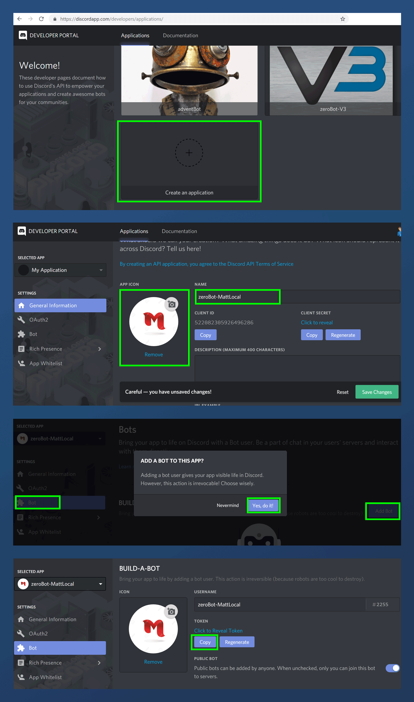

# ZeroBot 3.0

## Development Installation
- Fork this repo
- Clone your fork to your local machine
- CD into the bots root directory
- Ensure you have python/build tools installed (see below)
- Run `npm install`
- Copy the contents of tokens-EXAMPLE.json into a new file called tokens.json, entering your own Discord Bot token (see below)
- Run `nodemon` on `node bot.js`

Once the bot boots up, check for a URL in your command prompt. It will start with (https://discordapp.com/oauth2/authorize?client_id=). Copy and paste this link into your browser and then select the server you wish to invite your testing bot too.

## Requirements
Some modules in this project get compiled using node-gyp which has 2 essential requirements: Python 2.7 and C++ Build Tools.

If you do not have python installed along with all the node-gyp dependencies, simply open Powershell or Git Bash with administrator privileges and execute:

`npm install --global --production windows-build-tools`

and then to install the package:

`npm install --global node-gyp`

once installed, you will have all the node-gyp dependencies downloaded, but you still need the environment variable. Validate Python is indeed found in the correct folder:

C:\Users\<YOUR USER>\.windows-build-tools\python27\python.exe 
Note - it uses python 2.7 not 3.x as it is not supported

If it doesn't moan, go ahead and create your (user) environment variable:

setx PYTHON "%USERPROFILE%\.windows-build-tools\python27\python.exe"

Close the Powershell terminal and restart your command prompt.

## Getting a Discord Bot Token
- Head on over to https://discordapp.com/developers/applications/
- Sign in with your Discord account, if you are not already signed in
- Click the "Create an Application" card
- On the "General Information" Tab, give your bot a name and an avatar image
- Click the bot tab on the left hand side menu
- Then click "Add Bot" & confirm by clicking "Yes, Do it"

